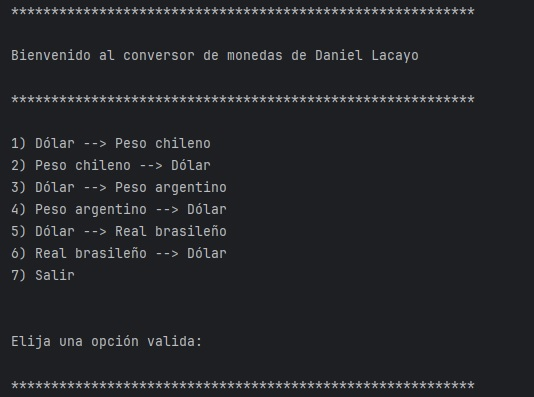
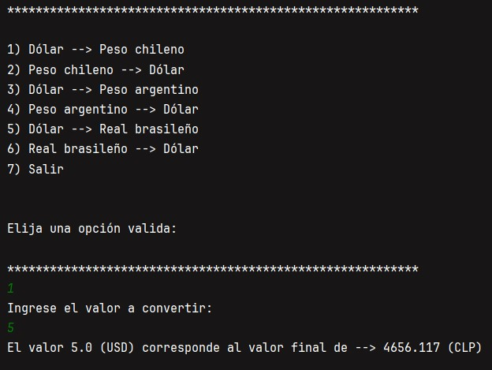
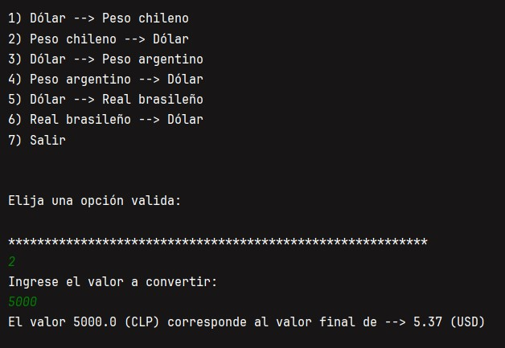

# Conversor de Monedas 💱

Este programa Java te permite convertir entre varias monedas utilizando la API de ExchangeRate-API.

# Funcionalidades ⚙️
## 🚀 Iniciar la Aplicación

Al ejecutar la aplicación, se muestra un menú con opciones para convertir entre diferentes monedas.

# 📋 Menú de Opciones

El menú muestra las siguientes opciones:

# 📋 Ejemplos 

## Convertir de Dolar a Peso Chileno 

## Convertir de Peso Chileno a Dolar 

# 🔄 Conversión de Moneda

Una vez seleccionada una opción válida, se solicita ingresar el valor a convertir. Luego, se realiza la conversión utilizando la API y se muestra el resultado.

# 🛑 Salida del Programa

La opción 7) Salir permite cerrar la aplicación de manera controlada.

# 💻 Tecnologías Utilizadas

- Java 17
- API de ExchangeRate-API
- Librería HttpClient para hacer solicitudes HTTP
- Librería Gson para parsear respuestas JSON

# 📋 Requisitos

- JDK 11 o superior
- Acceso a Internet para consultar la API de ExchangeRate-API

# ⚙️ Configuración

Antes de ejecutar el programa, asegúrate de configurar la variable API_KEY en ConversorApp.java con tu propia clave de API de ExchangeRate-API.

# 📧 Autor

- Claudio Machuca
- claudio.a97@outlook.es
- Formacion Java Orientado a Objetos G6 - ONE
- Alura Latam
- Oracle Next Education
